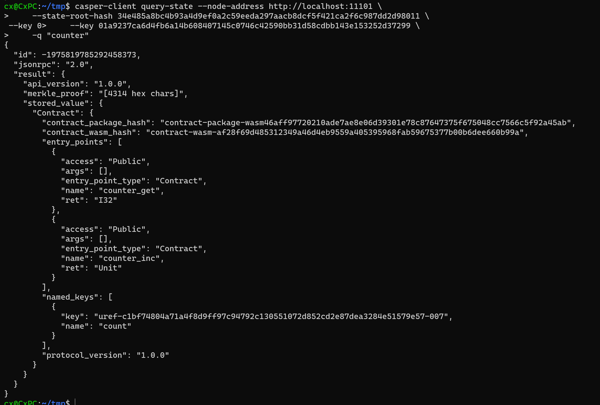

### Create and deploy a simple, smart contract with cargo casper and cargo test
- Write a contract build & test
```shell
make build
make test
```


- Deploy a test node


- Deploy a contract
```shell
casper-client put-deploy --chain-name casper-net-1 --node-address http://localhost:11101 --secret-key /home/cx/casper/casper-node/utils/nctl/assets/net-1/users/user-10/secret_key.pem --session-path /home/cx/casper/casper-node/target/wasm32-unknown-unknown/release/do_nothing.wasm  --payment-amount 10000000
```

```shell
casper-client get-deploy --node-address http://localhost:11101 0fe183ad65d687f0d1182c2b01c44aae0ca1de9ee88548270b63cc27d0884116
```
- Get deploy status


### Complete one of the existing tutorials for writing smart contracts

- build and deploy

```shell
git clone https://github.com/casper-ecosystem/counter
cd counter
make prepare
make test
casper-client put-deploy --chain-name casper-net-1 --node-address http://localhost:11101 \
--secret-key /home/cx/casper/casper-node/utils/nctl/assets/net-1/faucet/secret_key.pem \
--session-path target/wasm32-unknown-unknown/release/counter-define.wasm \
--payment-amount 5000000000000

# deploy hash 649c0876939b091aba34ffda90102becaf5a937f29e20a01f23524a4ff562733
casper-client get-deploy --node-address http://localhost:11101 649c0876939b091aba34ffda90102becaf5a937f29e20a01f23524a4ff562733
```


- check state

```shell
casper-client get-state-root-hash --node-address http://localhost:11101
# 34e485a8bc4b93a4d9ef0a2c59eeda297aacb8dcf5f421ca2f6c987dd2d98011

casper-client query-state \
    --node-address http://localhost:11101 \
    --state-root-hash 34e485a8bc4b93a4d9ef0a2c59eeda297aacb8dcf5f421ca2f6c987dd2d98011 \
    --key 01a9237ca6d4fb6a14b608407145c0746c42590bb31d58cdbb143e153252d37299
```


```shell
casper-client query-state --node-address http://localhost:11101 \
    --state-root-hash 34e485a8bc4b93a4d9ef0a2c59eeda297aacb8dcf5f421ca2f6c987dd2d98011 \
    --key 01a9237ca6d4fb6a14b608407145c0746c42590bb31d58cdbb143e153252d37299 \
    -q "counter"
```


- call

Because I run many times so in the screenshot, the value is 5.

```shell
casper-client put-deploy \
    --node-address http://localhost:11101 \
    --chain-name casper-net-1 \
    --secret-key /home/cx/casper/casper-node/utils/nctl/assets/net-1/faucet/secret_key.pem \
    --payment-amount 5000000000000 \
    --session-name "counter" \
    --session-entry-point "counter_inc"
    
casper-client get-state-root-hash --node-address http://localhost:11101
# 99afffbe820a51a93e642941364795fcd43cf48da59dc076b1b5482fe92819c1
casper-client query-state --node-address http://localhost:11101 \
    --state-root-hash 99afffbe820a51a93e642941364795fcd43cf48da59dc076b1b5482fe92819c1 \
    --key 01a9237ca6d4fb6a14b608407145c0746c42590bb31d58cdbb143e153252d37299 -q "counter/count"

```


### Demonstrate key management concepts by modifying the client in the Multi-Sig tutorial to address one of the additional scenarios
- Clone the code and build the contract

```shell
git clone https://github.com/casper-ecosystem/keys-manager
cd keys-manager/contract
rustup target add --toolchain $(cat rust-toolchain) wasm32-unknown-unknown
cargo build --release
```


- Start client
```shell
npm run start:atomic
```


#### Signing transactions with a single key


### Learn to transfer tokens to an account on the Casper Testnet. Check out this documentation.

- Transfer

```shell
casper-client transfer \
    --chain-name casper-net-1 --node-address http://localhost:11101 \
    --id 1 \
    --transfer-id 123456789012345 \
    --amount 2500000000 \
    --secret-key /home/cx/casper/casper-node/utils/nctl/assets/net-1/faucet/secret_key.pem \
    --target-account 0175ff4ec1a69985cb84191cde44b28781eac4c8897a8237a1a73185466d35da77 \
    --payment-amount 5000000000000
```


- Get deploy status && Query target account

```shell
casper-client get-state-root-hash --node-address http://localhost:11101
# 1b94984b48df5c7e9b908683b9e395fd7445f6a62e76555d4992db8f86e67226
casper-client query-state \
      --node-address http://localhost:11101 \
      --state-root-hash 1b94984b48df5c7e9b908683b9e395fd7445f6a62e76555d4992db8f86e67226 \
      --key 0175ff4ec1a69985cb84191cde44b28781eac4c8897a8237a1a73185466d35da77

casper-client get-state-root-hash --node-address http://localhost:11101
# 19c83def185bb7119e3e30d38dcf581e0b37c779d7191777f6854ce0d70dc935
casper-client get-balance \
      --id 7 \
      --node-address http://localhost:11101 \
      --state-root-hash 19c83def185bb7119e3e30d38dcf581e0b37c779d7191777f6854ce0d70dc935 \
      --purse-uref uref-666e69d42fd5e0202af56e15388914e728d03b7cf54292f51d802f5ad24dff2c-007
```


### Learn to Delegate and Undelegate on the Casper Testnet. Check out these instructions.

#### Delegate


#### Undelegate


